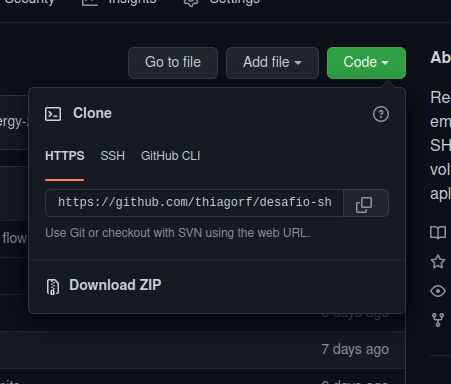

# Desafio Sharenergy

Para rodar o projeto baixe ou clone o respositorio com o seguinte comando:


```
  git clone (url do projeto)
```



Abra a pasta com o projeto e rode ```yarn dev``` ou ```npm run dev```, abre o navegador na url:
http://localhost:3000/


Video apresentando o projeto
https://www.youtube.com/watch?v=0tph1Fb1GmE
